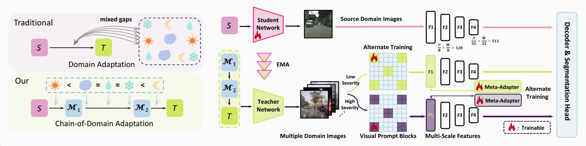

## CoDA: Instructive Chain-of-Domain Adaptation with Severity-Aware Visual Prompt Tuning 


🌟💫 Here is the official project of [CoDA](). 

🔥🔥🔥CoDA is a UDA methodology that boosts models to understand all adverse scenes by highlighting the discrepancies within these scenes.
CoDA achieves state-of-the-art performances on widely used benchmarks.

&nbsp;&nbsp;&nbsp;<a href="" target='_blank'> </a> 



## Traning Steps
```bash
Python ./tools/train.py --config ./configs/coda/csHR2acdcHR_coda.py --work-dir ./workdir/cs2acdc
```
## demo
```bash
Python ./tools/image_demo.py --img ./images/night_demo.png --config ./configs/coda/csHR2acdcHR_coda.py --checkpoint ./pretrained/CoDA_cs2acdc.pth
```
## Inference Steps
```bash
Python ./tools/image_demo.py --img_dir ./acdc_dir --config ./configs/coda/csHR2acdcHR_coda.py --checkpoint ./pretrained/CoDA_cs2acdc.pth --out_dir ./workdir/cs2acdc
```