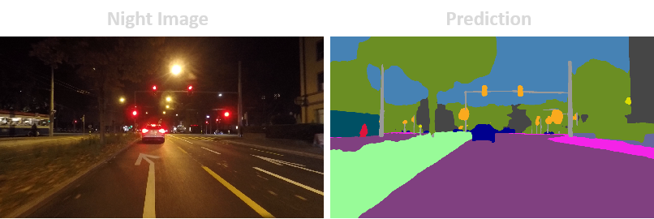

# [ECCV 2024] CoDA: Instructive Chain-of-Domain Adaptation with Severity-Aware Visual Prompt Tuning 

<div align="center">
  <table>
    <tr>
      <td align="center">
        <br>
        <span style="font-size: 18px;"><b>Sun Yat-sen University</b></span>
      </td>
      <td align="center">
        <br>
        <span style="font-size: 18px;"><b>CPNT Lab</b></span>
      </td>
      <td align="center">
        <br>
        <span style="font-size: 18px;"><b>EPFL</b></span>
      </td>
    </tr>
  </table>
</div>


## 🌟🌟🌟 Home
Here is the official project of 🎻[CoDA](). We are releasing the training code and dataset generated by ourselves in our paper.

CoDA is a UDA methodology that boosts models to understand all adverse scenes (☁️,☔,❄️,&#x1F319;) by highlighting the discrepancies between and within these scenes.
CoDA achieves state-of-the-art performances on widely used benchmarks.
## 🔥🔥🔥 News
[2024-7-2] We are delighted to inform that CoDA has been accepted by ECCV 2024 main conference 🎉🎉🎉!!!

[2024-3-8] We create the official project of CoDA and release the inference code.




[](https://paperswithcode.com/sota/domain-adaptation-on-cityscapes-to?p=coda-instructive-chain-of-domain-adaptation)

[](https://paperswithcode.com/sota/domain-adaptation-on-cityscapes-to-1?p=coda-instructive-chain-of-domain-adaptation)

[](https://paperswithcode.com/sota/domain-adaptation-on-cityscapes-to-acdc?p=coda-instructive-chain-of-domain-adaptation)

[](https://paperswithcode.com/sota/semantic-segmentation-on-nighttime-driving?p=coda-instructive-chain-of-domain-adaptation)

[](https://paperswithcode.com/sota/semantic-segmentation-on-dark-zurich?p=coda-instructive-chain-of-domain-adaptation)
<a href="" target='_blank'> </a> 
<!-- 
  -->


| Experiments | mIoU | Checkpoint |
|-|-|-|
|**Cityscapes $\rightarrow$ ACDC**|**72.6**|-|
|**Cityscapes $\rightarrow$ Foggy Zurich**|**60.9**|-|
|**Cityscapes $\rightarrow$ Foggy Driving**|**61.0**|-|
|**Cityscapes $\rightarrow$ Dark Zurich**|**61.2**|-|
|**Cityscapes $\rightarrow$ Nighttime Driving**|**59.2**|-|
|**Cityscapes $\rightarrow$ BDD100K-Night**|**41.6**|-|

## Download Checkpoint
```bash
cd CoDA
python ./tools/download_ck.py
```
or you can manually download checkpoints from [Google Drive](https://drive.google.com/drive/folders/1NKfgJZtLGXpqs7zKvI8KpKpJmTYCRtyB?usp=drive_link).

## Environment
```
conda create -n coda python=3.8.5 pip=22.3.1
conda activate coda
pip install -r requirements.txt -f https://download.pytorch.org/whl/torch_stable.html
pip install mmcv-full==1.3.7 -f https://download.openmmlab.com/mmcv/dist/cu110/torch1.7/index.html
```
Before run demo, first configure the PYTHONPATH, or you may encounter error like 'can not found tools...'.
```bash
cd CoDA
export PYTHONPATH=.:$PYTHONPATH
```
or directly modify the .bashrc file
```bash
vi ~/.bashrc
export PYTHONPATH=your path/CoDA:$PYTHONPATH
source ~/.bashrc
```

## demo
```bash
python ./tools/image_demo.py --img ./images/night_demo.png --config ./configs/coda/csHR2acdcHR_coda.py --checkpoint ./pretrained/CoDA_cs2acdc.pth
```
## Inference Steps
```bash
python ./tools/image_demo.py --img_dir ./acdc_dir --config ./configs/coda/csHR2acdcHR_coda.py --checkpoint ./pretrained/CoDA_cs2acdc.pth --out_dir ./workdir/cs2acdc
```
## Traning Steps
```bash
python ./tools/train.py --config ./configs/coda/csHR2acdcHR_coda.py --work-dir ./workdir/cs2acdc
```
